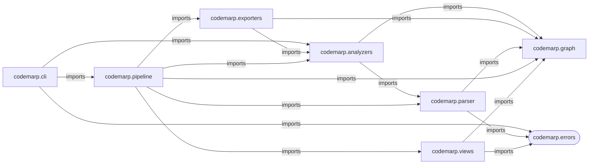
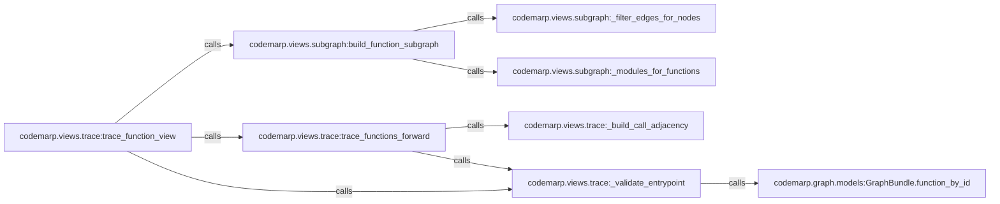
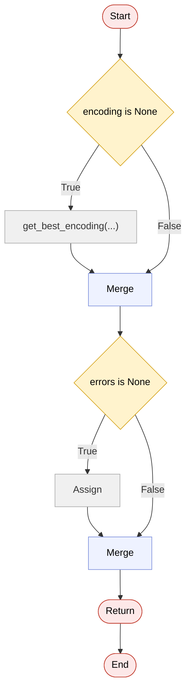

# CodeMarp

**Multi-level code architecture and relationship mapping**

> Understand a codebase like a map — zoom in, zoom out, follow the flow.

---

## The problem

Large codebases are hard to navigate. You open a file and you're already lost. You don't know what calls what, where things live, or what actually happens inside a function.

Documentation is outdated. Diagrams don't exist. The only way to understand the code is to read all of it.

CodeMarp takes a different approach: it builds the map for you.
---

## What CodeMarp does

Given a Python repository, CodeMarp gives you three zoom levels:

| Level | What you see |
|-------|-------------|
| **High** | Module and package architecture — how things are organised |
| **Mid** | Function relationships — who calls what |
| **Low** | Control flow inside a function — what actually happens |

Think of it as **Google Maps for your codebase**. Built entirely from static analysis — no runtime, no instrumentation.

Zoom out to see the city. Zoom in to see the streets. Zoom in further to see the building layout.

---

## Quickstart

Run CodeMarp on a Python repository:

```bash
codemarp analyze src --out out
```

This generates:

```text
out/
  high_level.mmd
  mid_level.mmd
  graph.json
```

To zoom into one function:

```bash
codemarp analyze src --view low --focus codemarp.cli.main:analyze_command --out out
```

---

## Output

Every analysis produces:

```
out/
  high_level.mmd    # architecture graph
  mid_level.mmd     # function call graph
  low_level.mmd     # control flow (when using --view low)
  graph.json        # full graph data for tooling
```

- **Mermaid** (`.mmd`) — renders in GitHub, VS Code, Mermaid Live Editor
- **JSON** — for tooling, integrations, and future UI

---

## Install

For local development in this repo:

```bash
uv sync --extra dev
```

To install in a project environment:

```bash
uv pip install codemarp
```

Or with pip:

```bash
pip install codemarp
```

---

## Usage

### Analyse a repo

```bash
codemarp analyze path/to/repo --out out
```

Point at the folder that **contains your top-level package**:

```bash
# flat layout: mypackage/ is at root
codemarp analyze .

# src layout: mypackage/ is inside src/
codemarp analyze src
```

---

### Views

#### Full (default)
See the entire graph — architecture + all function relationships.

```bash
codemarp analyze path/to/repo --view full --out out
```

#### Trace — what does this function call?
Follow a function forward through the call graph.

```bash
codemarp analyze path/to/repo \
  --view trace \
  --focus package.module:function_name \
  --max-depth 3 \
  --out out
```

#### Reverse — what calls this function?
Find every path that leads to a function.

```bash
codemarp analyze path/to/repo \
  --view reverse \
  --focus package.module:function_name \
  --max-depth 3 \
  --out out
```

#### Module — zoom into one module
Show the functions and internal relationships for a single module.

```bash
codemarp analyze path/to/repo \
  --view module \
  --module package.module_name \
  --out out
```

#### Low — what happens inside this function?
Build a control-flow graph for one function.

```bash
codemarp analyze path/to/repo \
  --view low \
  --focus package.module:function_name \
  --out out
```

---

## Typical workflow

```
1. codemarp analyze src --view full
   → understand the overall structure

2. codemarp analyze src --view module --module mypackage.core
   → inspect one area

3. codemarp analyze src --view trace --focus mypackage.core:run --max-depth 3
   → follow a specific entrypoint

4. codemarp analyze src --view low --focus mypackage.core:run
   → zoom into the logic
```

---

## Viewing the output

Mermaid files render automatically in:

- **GitHub** — renders Mermaid blocks directly in Markdown files
- **[Mermaid Live Editor](https://mermaid.live)** — paste and share
- **VS Code** — with the Mermaid Preview extension

Yes, GitHub renders Mermaid blocks directly in Markdown, so the sample diagrams below should display in the repo README.

---

## Sample output

These examples were generated from the CodeMarp codebase itself.

### High-level architecture

Command:

```bash
codemarp analyze src --view full --out samples/codemarp_full_out
```

Excerpt from [`samples/codemarp_full_out/high_level.mmd`](samples/codemarp_full_out/high_level.mmd):



This is the zoomed-out package view: which parts of the project depend on which others.

### Focused function trace

Command:

```bash
codemarp analyze src --focus codemarp.cli.main:analyze_command --out out
```

Excerpt from [`samples/codemarp_trace_out/mid_level.mmd`](samples/codemarp_trace_out/mid_level.mmd):



This is the focused mid-level view: starting from one function, you can follow the call chain it reaches.

### Low-level control flow

Command:

```bash
codemarp analyze src --view low --focus codemarp.parser.python_parser:get_source --out out
```

Excerpt from [`samples/codemarp_low_out/low_level.mmd`](samples/codemarp_low_out/low_level.mmd):



This is the zoomed-in function view: branches, merges, and return flow inside a single function.

---

## Known limitations

CodeMarp is static analysis — it reads your code without running it.

| Limitation | Workaround |
|-----------|------------|
| Relative imports may produce sparse high-level graphs | Use `--view module` or `--view trace` instead |
| Method calls (`self.method()`) are conservatively handled | Some valid edges may be missing, but false positives are reduced |
| Dynamic dispatch is not tracked | Results reflect static structure only |
| Large full graphs can be hard to read | Use focused views — `trace`, `module`, `reverse` |

These are honest limitations, not bugs. Focused views exist precisely because full graphs on real codebases get noisy.

---

## Roadmap

- Better call resolution (method dispatch, aliases)
- Graph filtering and noise reduction
- Tree-sitter migration → multi-language support
- JavaScript / TypeScript support
- Interactive web UI

---

## Philosophy

**Useful before perfect.**
CodeMarp v0.1 is not exhaustive. It is correct for common cases and honest about where it isn't.

**Readable before complete.**
A graph you can understand is more valuable than a graph that shows everything.

**Static first.**
No runtime instrumentation. No code execution. Analysis runs anywhere.

---

## Status

- Python only (AST-based, tree-sitter planned)
- CLI-first
- v0.1.0 — early but usable on real codebases

---

## Name

**CodeMarp** — sounds like "code map", because that's what it produces.

If you want an expansion: *Code Mapping, Architecture, Relationships, and Paths*

---

*Built to answer the question every developer asks when they open an unfamiliar codebase: where do I even start?*
