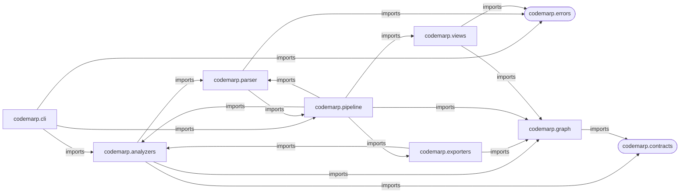
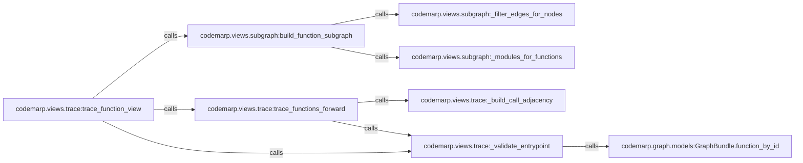
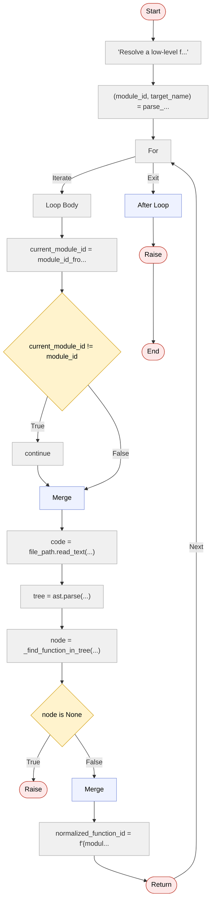

# CodeMarp

**Multi-level Code Architecture and Relationship Mapping**

> Understand a codebase like a map — zoom in, zoom out, follow the flow.

---

## The problem

Large codebases are hard to navigate. You open a file and you're already lost. You don't know what calls what, where things live, or what actually happens inside a function.

Documentation is outdated. Diagrams don't exist. The only way to understand the code is to read all of it.

CodeMarp takes a different approach: it builds the map for you.

---

## What CodeMarp does

Given a Python or TypeScript repository, CodeMarp maps the codebase at multiple zoom levels:

| Level | What you see |
|-------|-------------|
| **High** | Module and package architecture — how things are organised |
| **Mid** | Function relationships — who calls what |
| **Low** | Control flow inside a function — what actually happens |

Think of it as **Google Maps for your codebase**. Built entirely from static analysis — no runtime, no instrumentation.

Zoom out to see the city. Zoom in to see the streets. Zoom in further to see the building layout.

---

## Graph Levels & Guarantees

CodeMarp produces three views of your codebase. Each view has a different goal and level of precision.

### High-level (architecture)

- Shows module and package relationships
- Built from import statements and grouping
- Best-effort approximation of architecture
- May be incomplete or sparse depending on project layout

### Mid-level (function relationships)

- Conservative call graph
- Resolves calls using:
  - same-module functions
  - imported symbols (`from x import y`)
  - imported modules (`import x; x.y()`)
  - unique module-level functions
- Avoids ambiguous resolution paths such as dynamic dispatch and unresolved method calls
- Prioritises **precision over recall**
  - fewer false positives
  - may miss valid edges

Each mid-level call edge includes a resolution reason:
- `same_module`
- `imported_symbol`
- `imported_module`
- `unique_global`

Use `--debug-resolution` to inspect how edges were resolved.

### Low-level (control flow)

- Function-level control flow graph (CFG)
- Shows branching, merging, and execution structure
- Structural only — does not model runtime behaviour
- Currently Python-only

---

## Quickstart

Run CodeMarp on a Python or TypeScript repository:

```bash
codemarp analyze src --out out
```

This generates:

```text
out/
  high_level.mmd
  mid_level.mmd
  graph.json
```

To zoom into one Python function:

```bash
codemarp analyze src --mode low --focus codemarp.cli.main:analyze_command --out out
```

---

## Output

Full, trace, reverse, and module views produce:

```
out/
  high_level.mmd    # architecture graph
  mid_level.mmd     # function call graph
  mid_level.json    # function graph data
  graph.json        # full graph data for tooling
```

Low view produces:

```
out/
  high_level.mmd    # architecture graph
  low_level.mmd     # control flow
  low_level.json    # control-flow graph data
  graph.json        # full graph data for tooling
```

- **Mermaid** (`.mmd`) — renders in GitHub, VS Code, Mermaid Live Editor
- **JSON** — for tooling, integrations, and future UI

---

## Install

For local development in this repo:

```bash
uv sync --extra dev
```

To install in a project environment:

```bash
uv pip install codemarp
```

Or with pip:

```bash
pip install codemarp
```

Or with Homebrew:

```bash
brew tap haddyadnan/forge
brew install codemarp
```

To install the CLI directly from source with uv:

```bash
uv tool install git+https://github.com/haddyadnan/codemarp.git
```

For a specific release tag:

```bash
uv tool install git+https://github.com/haddyadnan/codemarp.git@v0.3.2
```

---

## Usage

### Supported languages

| Language | Support |
|----------|---------|
| Python | Tree-sitter parser by default, AST parser available with `--parser-engine ast` |
| TypeScript | Tree-sitter parser for `.ts` and `.tsx` files |

JavaScript support is planned.

### Analyse a repo

```bash
codemarp analyze path/to/repo --out out
```

Point at the folder that **contains your top-level package**:

```bash
# flat layout: mypackage/ is at root
codemarp analyze .

# src layout: mypackage/ is inside src/
codemarp analyze src
```

---

### Views

#### Full (default)
See the entire graph — architecture + all function relationships.

```bash
codemarp analyze path/to/repo --mode full --out out
```

#### Trace — what does this function call?
Follow a function forward through the call graph.

```bash
codemarp analyze path/to/repo \
  --mode trace \
  --focus package.module:function_name \
  --max-depth 3 \
  --out out
```

#### Reverse — what calls this function?
Find every path that leads to a function.

```bash
codemarp analyze path/to/repo \
  --mode reverse \
  --focus package.module:function_name \
  --max-depth 3 \
  --out out
```

#### Module — zoom into one module
Show the functions and internal relationships for a single module.

```bash
codemarp analyze path/to/repo \
  --mode module \
  --module package.module_name \
  --out out
```

#### Low — what happens inside this function?
Build a control-flow graph for one function.

```bash
codemarp analyze path/to/repo \
  --mode low \
  --focus package.module:function_name \
  --out out
```

### Debug call resolution

Use `--debug-resolution` to print why mid-level call edges were resolved. This is useful when checking whether a call edge came from an imported symbol, a local function, or another resolver path.

```bash
codemarp analyze path/to/repo --out out --debug-resolution
```

The debug output is printed to stdout, so you can pipe it into a file:

```bash
codemarp analyze path/to/repo --out out --debug-resolution > debug.txt
```

The generated graph files are still written to the directory passed with `--out`.

---

## Typical workflow

```
1. codemarp analyze src --mode full
   → understand the overall structure

2. codemarp analyze src --mode module --module mypackage.core
   → inspect one area

3. codemarp analyze src --mode trace --focus mypackage.core:run --max-depth 3
   → follow a specific entrypoint

4. codemarp analyze src --mode low --focus mypackage.core:run
   → zoom into the logic
```

---

## Viewing the output

Mermaid files render automatically in:

- **GitHub** — renders Mermaid blocks directly in Markdown files
- **[Mermaid Live Editor](https://mermaid.live)** — paste and share
- **VS Code** — with the Mermaid Preview extension

Yes, GitHub renders Mermaid blocks directly in Markdown, so the sample diagrams below should display in the repo README.

---

## Sample output

These examples were generated from the CodeMarp codebase itself.

### High-level architecture

Command:

```bash
codemarp analyze src --mode full --out samples/codemarp_full_out
```

Excerpt from [`samples/codemarp_full_out/high_level.mmd`](samples/codemarp_full_out/high_level.mmd):



This is the zoomed-out package view: which parts of the project depend on which others.

### Focused function trace

Command:

```bash
codemarp analyze src --mode trace --focus codemarp.cli.main:analyze_command --out samples/codemarp_trace_out
```

Excerpt from [`samples/codemarp_trace_out/mid_level.mmd`](samples/codemarp_trace_out/mid_level.mmd):



This is the focused mid-level view: starting from one function, you can follow the call chain it reaches.

### Low-level control flow

Command:

```bash
codemarp analyze src --mode low --focus codemarp.parser.python.low_level:find_function_node --out samples/codemarp_low_out
```

Excerpt from [`samples/codemarp_low_out/low_level.mmd`](samples/codemarp_low_out/low_level.mmd):



This is the zoomed-in function view: branches, merges, and return flow inside a single function.

---

## Known limitations

CodeMarp is static analysis — it reads your code without running it.

| Limitation | Workaround |
|-----------|------------|
| Relative imports may produce sparse high-level graphs | Use `--mode module` or `--mode trace` instead |
| Method calls (`self.method()`) are conservatively handled | Some valid edges may be missing, but false positives are reduced |
| Dynamic dispatch is not tracked | Results reflect static structure only |
| TypeScript support is first-pass | Function/import/call facts are extracted, but some language forms are still omitted |
| Low-level CFG is Python-only | Use high, mid, trace, reverse, or module views for TypeScript |
| Large full graphs can be hard to read | Use focused views — `trace`, `module`, `reverse` |

These are honest limitations, not bugs. Focused views exist precisely because full graphs on real codebases get noisy.

---

## Roadmap

- Better call resolution (method dispatch, aliases)
- Graph filtering and noise reduction
- JavaScript support through tree-sitter
- Broader TypeScript coverage
- Language-neutral low-level CFG
- Interactive web UI

---

## Philosophy

**Useful before perfect.**
CodeMarp is not exhaustive. It is correct for common cases and honest about where it isn't.

**Readable before complete.**
A graph you can understand is more valuable than a graph that shows everything.

**Static first.**
No runtime instrumentation. No code execution. Analysis runs anywhere.

---

## Status

- Python and TypeScript support
- Tree-sitter default parser
- Python AST fallback available with `--parser-engine ast`
- CLI-first
- v0.3.x — early but usable on real codebases

---

## Name

**CodeMarp** — sounds like "code map", because that's what it produces.

---

*Built to answer the question every developer asks when they open an unfamiliar codebase: where do I even start?*
